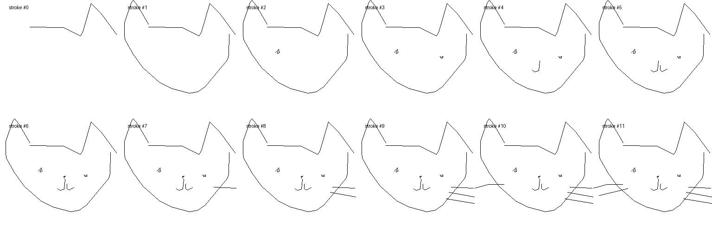

<div align=center>
  <h1>
  :pencil2: Sequential Sketch Stroke Generation
  </h1>
  <p>
    <a href=https://mhsung.github.io/kaist-cs492d-fall-2024/ target="_blank"><b>KAIST CS492(D): Diffusion Models and Their Applications (Fall 2024)</b></a><br>
    Course Project
  </p>
</div>

<div align=center>
  <p>
    Instructor: <a href=https://mhsung.github.io target="_blank"><b>Minhyuk Sung</b></a> (mhsung [at] kaist.ac.kr)<br>
    TA: <a href=https://phillipinseoul.github.io/ target="_blank"><b>Yuseung Lee</b></a>  (phillip0701 [at] kaist.ac.kr)
  </p>
</div>

<div align=center>
   
   <figcaption>
    Collection of 50 million drawings across 345 categories, contributed by players of the game Quick, Draw!. Drawings were captured as timestamped vectors.
    <i>Source: <a href="https://quickdraw.withgoogle.com/data/">Quick, Draw! Dataset.</a></i>
    </figcaption>
</div>

## Description
In this project, your goal is to implement a conditional diffusion model that generates sequential strokes to form a sketch. You will utilize user-captured sketch strokes, complete with timestamps, from 345 different object categories provided by the [Quick, Draw!](https://quickdraw.withgoogle.com/data/) dataset. Rather than generating the entire sketch at once, the focus should be on leveraging the sequential (or part-aware) stroke information for training the model, encouraging a stroke-by-stroke generation process that reflects how users naturally draw.

## Tasks
Your task is to implement a conditional diffusion model that generates sequential strokes to form a sketch. While there are 345 different categories, we choose three categories (`cat`, `garden`, `helicopter`) and train a diffusion model on each category. **So you will have three different diffusion models in total.**

Along with a detailed report, include the quantitative evaluations (FID, KID) as described in the below section.

## Data Specification
### (1) Download Quick, Draw! Dataset
The dataset consists of sketches from 345 different categories, and each sketch is drawn with varying number of strokes.

Use the following bash script to download the Quick, Draw! dataset:
```
sh download_quickdraw.sh
```

For extracting the `.ndjson` file for each category and visualizing the source data, refer to our sample code in `load_data.ipynb`. An example sequence of strokes is shown below:

<div align=center>
  
</div>

### (2) Filter Train/Test Subsets for Target Categories
We will use the three categories, `cat`, `garden`, `helicopter`, for training and evaluation. After you've downloaded Quick, Draw! dataset in the `./data` directory, simple run the below command to obtain the training and testing data for the three different categories:
```bash
sh filter_data_all.sh
```
Then the indices for the sketches to be in the training, test subsets will the stored in `./sketch/$CATEGORY/train_test_indices.json` file. The indices are already provided. For visualization, the images of each sketch will be stored in the `images_train`, `images_test` directories, respectively.


## Evaluation

While detailed explanations and qualitative results are essential, you must also provide quantitative evaluations of your model. For evaluation, the test images stored in `images_test` for each category must be used.

Compute the FID (Fréchet Inception Distance) and KID (Kernel Inception Distance) between the test set and your generated sketches. To do this, first install the FID library by running:
```bash
pip install clean-fid
``` 

Then, compute the FID and KID score using the following command:
```bash
python run_eval.py --fdir1 $TEST_DATA_DIR --fdir2 $YOUR_DATA_DIR
```
Here, `$YOUR_DATA_DIR` refers to the directory containing the generated sketches from your model, saved as .png or .jpg files. **Since you train a diffusion model separately on three different categories, you must return three pairs of FID, KID scores.**

## Acknowledgement 
We appreciate Google Creative Lab for releasing the [Quick, Draw!](https://oppo-us-research.github.io/OpenIllumination/) dataset to public. The contents adhere to the [Creative Commons License](https://creativecommons.org/licenses/by/4.0/).